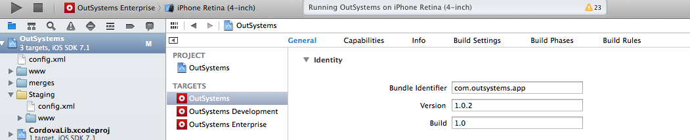

# OutSystems Now (iOS)

This is the open source code for the old version of OutSystems Now.
This version brings your OutSystems experience to your mobile device, providing a fast way to access all your applications including CRM, Customer Portal, or any other custom app built with OutSystems. 

Note that this is a **deprecated version of OutSystems Now and is no longer supported** by OutSystems. You can find more details on the [OutSystems Now website](https://now.outsystems.com).

The source code is made available for you to create your own version of the application.

This way you can apply your own branding such as the application name, logo and splash screens.

You also have control over push notifications and enhance your business with a true mobile experience.

## Requirements

You will need the iOS development environment, XCode, and an [iOS developer](https://developer.apple.com/programs) account. You can submit the app to the App Store, once it complies with the store guidelines. **The newly created application will be under your responsibility and should be supported by you**.

## Steps for building your own customized OutSystems Now

### 1. Get the source code

You can either clone or fork the provided repository or just download it as a zip file to have a local copy.

### 2. Setup your development environment

Download [XCode](https://developer.apple.com/xcode) to your Mac and open the **OutSystems.xcodeproj** project file in the folder platforms\ios.

### 3. Customize your OutSystems Now

Open the GitHub source code in your development environment to start building your own version of the app. To learn more about the XCode development environment checkout the [Xcode Overview](https://developer.apple.com/library/ios/documentation/ToolsLanguages/Conceptual/Xcode_Overview/About_Xcode/about.html#//apple_ref/doc/uid/TP40010215-CH1-SW1).

#### Change the application name and bundle identifier

Creating your own application means that you need to create a new application **Bundle Identifier**. Select the OutSystems project and then the OutSystems target (the other ones are solely for internal development). You can find the Application Identifier in the Identity Settings, under the General tab. You will not be able to use a Bundle Identifier already in use by another application, therefore it's probable you find inverted addresses like com.outsystems.appname.

To change the application name on the home screen, still under the same target, select the Build Settings tab and scroll down to the Packaging section. There you will find a setting for **Product Name**. Double click on the value and update it with the new name.

#### Replace the application logo and splash screens

In your XCode project you can find all images related with the application logo and splash screen under OutSystems > Resources > Images.xcassets. You will need several different image sizes due to the multitude of devices with or without retina displays. For further details, check the [iOS Human Interface Guidelines](https://developer.apple.com/library/ios/documentation/UserExperience/Conceptual/MobileHIG/IconMatrix.html#//apple_ref/doc/uid/TP40006556-CH27-SW1) online.

#### Enable Push Messages on your application

To push notifications we suggest that you use a third-party service such as [Pushwoosh](http://www.pushwoosh.com/) or [UrbanShip](http://urbanairship.com/) (paid services). These services simplify the whole process of pushing notifications and, better yet, they provide a single way of doing it for iOS, Android and Windows. No need to develop custom push mechanisms for each vendor. There are several other companies offering the same services and you can work with any of those if you wish. Most of them are paid services, so a subscription fee may be necessary.

To learn more about Push Notifications, check out the information online about Local [Notifications and Push Notifications](https://developer.apple.com/library/ios/documentation/NetworkingInternet/Conceptual/RemoteNotificationsPG/Chapters/ApplePushService.html). For iOS, you will be required to create a **provisioning profile** that supports push notifications.

#### Enable Deep Linking on your application

To enable the deep linking feature on your application, change the **Application Protocol**. Select the OutSystems project and then the OutSystems target (the other ones are solely for internal development). You can find the Application Protocol in the URL Types settings under the Info tab. Change the **Identifier** with yours and choose the new **URL Schema** for your application. Also, you need to change the **URL Identifier** and the **URL Schema** on the Additional Url Type Properties settings.

### 4. Publish to the store

Once you have your own version of the OutSystems Now app, you can distribute it.  Learn how you can [distribute your app on the Apple Store](https://developer.apple.com/library/ios/documentation/IDEs/Conceptual/AppDistributionGuide/Introduction/Introduction.html#//apple_ref/doc/uid/TP40012582-CH1-SW1) for iOs.
